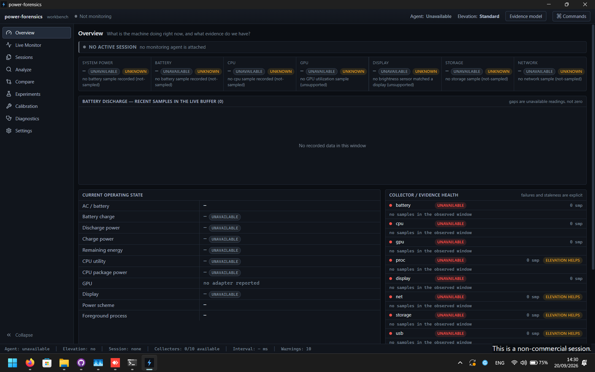
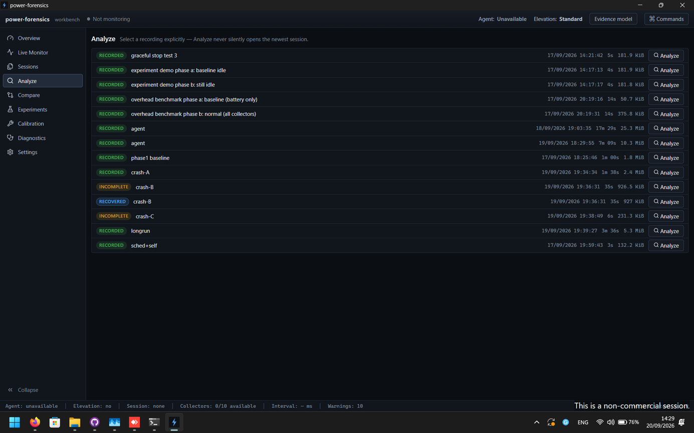
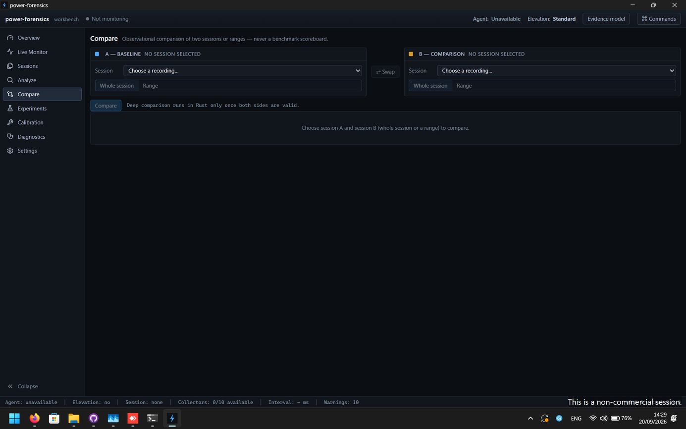
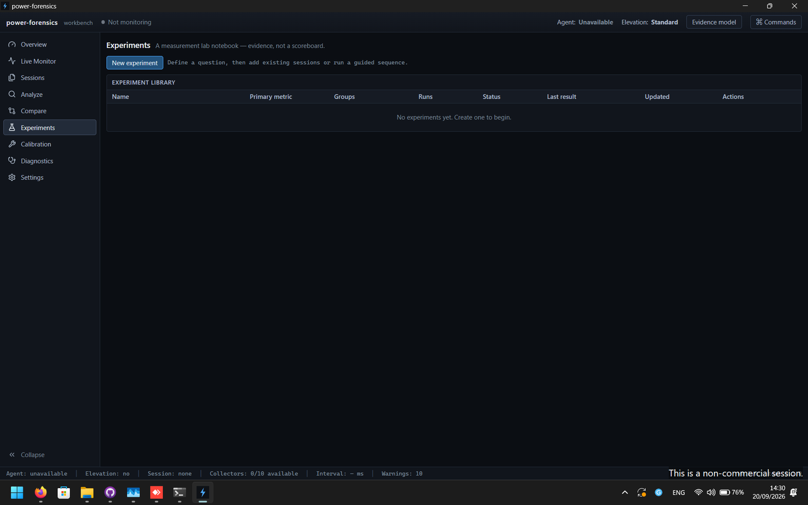
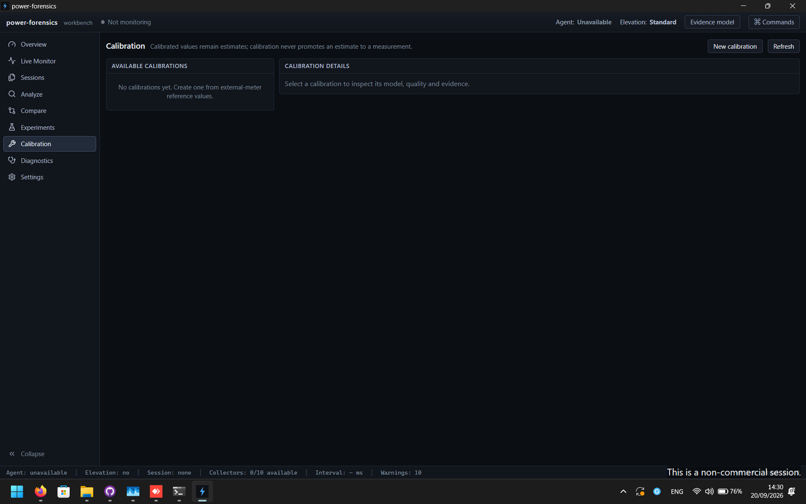

<div align="center">

# power-forensics

**Windows battery and power forensics that shows its evidence.**

Record system-wide power telemetry, investigate battery drain, compare before/after changes, and run repeatable power experiments without pretending estimates are measurements.

**Where did the watts go?**

[Download](#download) · [Quick start](#quick-start) · [How it works](#how-it-works) · [Privacy](#privacy) · [Build from source](#build-from-source)

[](https://github.com/GamerKingHD/power-forensics-public/actions/workflows/ci.yml)


[](LICENSE)

> **Pre-alpha:** power-forensics is usable, but the public `0.1.x` line is intentionally early. Expect rough edges, hardware-dependent telemetry, and format/API changes.

</div>



## What it does

power-forensics is a local Windows power-analysis workbench. It records battery and system telemetry over time, keeps the provenance and quality of every reading, and gives you tools to answer questions such as:

- What changed when battery drain jumped?
- Which CPU, GPU, display, storage, network, USB, process, or power-policy activity lined up with the change?
- Did a setting actually reduce power consumption, or did the test conditions change too?
- How much confidence should you place in the result?
- How much overhead did the profiler itself introduce?

It is not a generic hardware-monitor clone. The product is built around **evidence quality, time integrity, reproducible comparisons, and explicit uncertainty**.

## The evidence model

A number without provenance is not enough for forensics. Every telemetry value is carried through collection, storage, analysis, reports, and export as one of four states:

| State | Meaning |
| --- | --- |
| **Measured** | Read directly from a sensor or operating-system source. |
| **Derived** | Computed from recorded measurements. |
| **Estimated** | Produced by a model or calibration and never presented as a direct measurement. |
| **Unavailable** | Not observed; the reason is retained instead of silently substituting zero. |

power-forensics also keeps acquisition timestamps, freshness/quality, missing-data reasons, and evidence confidence. Correlation is reported as correlation; the analysis engine does not silently promote it to causation.

## Main capabilities

### Live recording

Record a machine-wide session with independent collector cadences for battery, CPU, GPU, processes, display, network, storage, USB, OS power policy, and profiler self-telemetry. The background agent owns the recording lifecycle, so closing the GUI does not silently destroy an active session.

### Analyze

Inspect a synchronized timeline, select a time range, and drill into energy use, telemetry quality, subsystem changes, process activity, events, and correlations.



### Compare

Compare whole sessions or exact ranges. Metrics carry explicit comparability and reliability instead of being forced into a single scoreboard. Duration, power-source changes, coverage, spread, cadence, and other confounders are surfaced with the result.



### Experiments

Run guided repeated A/B measurements. Each run is treated as the experimental unit, with settle periods, run-level statistics, ordering, confounder checks, and persisted experiment state.



### Calibration

Fit and validate machine-specific calibration data without rewriting raw evidence. Calibrated values remain visibly estimated.



### Reports and export

Generate self-contained HTML reports and export CSV/JSON for deeper analysis. Redaction is available when you need to share an artifact without exposing process and machine identifiers.

## Download

Public builds are published through [GitHub Releases](https://github.com/GamerKingHD/power-forensics-public/releases).

Each release is expected to contain:

- `power-forensics-<version>-x64-setup.exe` — per-user NSIS installer.
- `power-forensics-<version>-x64-portable.zip` — self-contained portable build.
- `SHA256SUMS.txt` — SHA-256 hashes for release artifacts.
- `release-manifest.json` — version, Git commit/tag, toolchain, signing state, and artifact hashes.

### Installer

Run the setup executable. Installation is per-user and the core application does not require administrator rights. The optional privileged helper is bundled for telemetry that Windows only exposes with elevation.

### Portable

Extract the ZIP to a writable folder and run `power-forensics-gui.exe`. Portable mode keeps sessions, settings, and logs next to the executable.

### Windows requirements

- Windows 10 or Windows 11, x86-64.
- Microsoft Edge WebView2 Runtime.
- No Rust toolchain is required to run a release build.
- No separate Visual C++ 2015–2022 redistributable is required by the packaged binaries.

The installer can bootstrap WebView2 from Microsoft when it is missing.

### SmartScreen

Early unsigned builds can trigger Windows SmartScreen because the publisher has no signing/reputation chain. Verify the SHA-256 against `SHA256SUMS.txt` before running an unsigned build:

```powershell
Get-FileHash .\power-forensics-<version>-x64-setup.exe -Algorithm SHA256
Get-Content .\SHA256SUMS.txt
```

For a signed build:

```powershell
Get-AuthenticodeSignature .\power-forensics-<version>-x64-setup.exe |
  Format-List Status,SignerCertificate,TimeStamperCertificate
```

## Quick start

1. Open **Overview**.
2. Optionally name the session and choose the recording interval/preset.
3. Select **Start monitoring**.
4. Reproduce the workload, battery drain, or configuration change you want to investigate.
5. Add markers when useful.
6. Stop the session cleanly.
7. Open **Analyze** for timeline/range analysis, **Compare** for before/after work, or **Experiments** for controlled repeated tests.

The full operator guide is in [docs/USAGE.md](docs/USAGE.md).

## What gets measured

Availability depends on Windows, firmware, drivers, and hardware. Unsupported fields remain unavailable rather than being synthesized.

| Domain | Examples |
| --- | --- |
| Battery | charge/discharge power, remaining/full/design capacity when exposed, energy integration, physical battery metadata |
| CPU | utilization, frequency/performance state, idle-state residency, context switches, interrupts/DPC, package-power sources when available |
| GPU | adapter/engine activity, per-process GPU activity, VRAM, awake evidence |
| Processes | identity, CPU, memory, I/O, thread/handle activity |
| Display | brightness, active modes, refresh rate, HDR state, display changes |
| Network | adapter inventory, Wi-Fi state, throughput, interface changes |
| Storage | IOPS, throughput, queue/latency evidence, sustained activity |
| USB/devices | device inventory, start/connect/disconnect state, power-requirement evidence |
| OS power | active scheme and relevant AC/DC power-policy settings |
| Self | power-forensics CPU, memory, I/O, and thread overhead |

Some privileged evidence can be added by the bundled `pf-elevated.exe` helper. Failure or refusal to elevate must degrade capability, not break the core recording.

## How it works

```text
┌──────────────────────────────────────────────┐
│             Tauri + React GUI                │
│ Overview · Live · Sessions · Analyze ·       │
│ Compare · Experiments · Calibration          │
├──────────────────────────────────────────────┤
│             Rust analysis core               │
│ provenance · quality · ranges · compare ·    │
│ experiments · reports · export · calibration │
├──────────────────────────────────────────────┤
│          background monitor agent            │
│ named-pipe IPC · scheduler · session writer  │
├──────────────────────────────────────────────┤
│                collectors                    │
│ battery · cpu · gpu · proc · display · net   │
│ storage · usb · os power · self              │
├──────────────────────────────────────────────┤
│                 Windows                      │
│ PDH · DXGI · WMI/COM · powrprof · SetupDi · │
│ iphlpapi · wlanapi · DisplayConfig · Win32   │
└──────────────────────────────────────────────┘
```

The Rust workspace is split by responsibility:

- `pf-core` — telemetry types, session loading, analysis, comparison, experiments, reports/export, calibration, archive format, statistics, IPC codec.
- `pf-collectors` — Windows telemetry collectors.
- `pf-agent` — scheduling, monitoring, session persistence, lifecycle, and named-pipe IPC.
- `pf-cli` — command-line interface and headless workflows.
- `pf-elevated` — optional privileged collector helper.
- `pf-gui` — Tauri 2 + React/TypeScript desktop interface.

Recordings use append-only JSONL with a session header, timestamped evidence/events, and a final footer. Interrupted recordings are detectable and can be recovered to a copy without modifying the original.

## CLI

The GUI is the normal entry point, but the engine can also be used directly:

```powershell
power-forensics.exe sample
power-forensics.exe capabilities --human
power-forensics.exe monitor
power-forensics.exe agent
power-forensics.exe sessions sessions
power-forensics.exe diagnose sessions\<file>.jsonl
power-forensics.exe compare <A.jsonl> <B.jsonl>
power-forensics.exe report <file>.jsonl
power-forensics.exe overhead
```

Run the binary with `--help` for the complete command surface.

## Privacy

power-forensics is local-first:

- no account;
- no cloud backend;
- no application telemetry upload;
- session data stays on the machine unless you explicitly export, copy, or share it.

Recordings can contain sensitive local information such as process/application names, machine configuration, device identifiers, and timestamps. Treat them as diagnostic captures. Redaction is opt-in for reports and exports.

See [PRIVACY.md](PRIVACY.md) for the full data-handling description.

### Data locations

Installed application:

```text
%LOCALAPPDATA%\power-forensics\
├── sessions\
└── logs\
```

Portable mode stores the equivalent data alongside the executable. Uninstalling the application preserves recordings and reports by design.

## Known limitations

- Windows x86-64 only.
- Telemetry quality is hardware/firmware/driver dependent.
- Battery power is only as accurate as the machine's exposed battery telemetry.
- Some evidence requires elevation.
- Estimated/calibrated values are not measurements and stay labelled accordingly.
- A profiler can affect the system it measures; power-forensics records self-overhead and provides an overhead benchmark, but no software profiler can make its observer effect disappear.
- This is a pre-alpha release line. File formats, UI, and command surfaces may still change.

## Build from source

### Prerequisites

- Windows x86-64.
- Rust `1.98.1` with `rustfmt`, `clippy`, and `x86_64-pc-windows-msvc`.
- Node.js 22+ and npm.

```powershell
git clone https://github.com/GamerKingHD/power-forensics-public.git
cd power-forensics-public

cd pf-gui
npm ci
npm run sidecar
cd ..

cargo fmt --all -- --check
cargo clippy --workspace --all-targets --locked -- -D warnings
cargo test --workspace --locked

cd pf-gui
npm run typecheck
npm test
npm run build
npm run check-version
```

To build the complete installer and portable release package from an exact `v<version>` release tag:

```powershell
cd ..
powershell -ExecutionPolicy Bypass -File scripts/release-windows.ps1
```

The release procedure, signing variables, smoke tests, and release checklist are documented in [docs/RELEASE.md](docs/RELEASE.md).

## Release integrity

The release pipeline is designed to fail closed on formatting, Clippy warnings, Rust tests, frontend type checks/tests/build, version mismatches, missing binaries, and signing failures when signing is required.

A release manifest records the exact Git commit and tag together with artifact hashes and toolchain versions. `SHA256SUMS.txt` is generated from the final packaged artifacts.

## Documentation

- [User guide](docs/USAGE.md)
- [Release procedure](docs/RELEASE.md)
- [Release notes template](docs/RELEASE_NOTES_TEMPLATE.md)
- [Contributing](CONTRIBUTING.md)
- [Privacy](PRIVACY.md)
- [Project attribution notice](NOTICE)
- [Third-party notices](THIRD_PARTY_NOTICES.txt)

## License

power-forensics is released under the [Apache License 2.0](LICENSE). You may use, modify, and redistribute the code under its terms, but the applicable copyright and attribution notices must be preserved. See [NOTICE](NOTICE) for the project attribution that derivative distributions must retain as required by Section 4(d). Third-party licenses distributed with the application are listed in [THIRD_PARTY_NOTICES.txt](THIRD_PARTY_NOTICES.txt).
